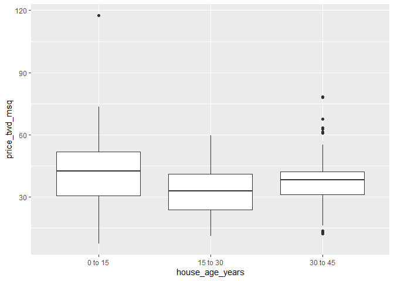
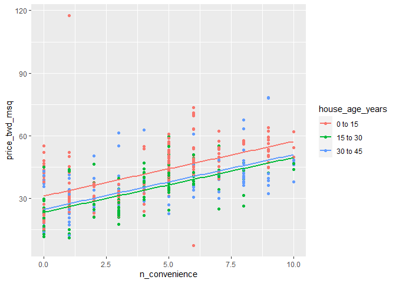

Taiwan Real Estate Analysis
================
Tanya Nayyar

## This document contains analysis done using the real estate data to predict real estate prices

## Data Set Information:

The market historical data set of real estate valuation is collected
from Sindian Dist., New Taipei City, Taiwan. This dataset is a classical
example of a regression problem.

## Attribute Information:

transaction\_date = the transaction date (for example, 2013.250=2013
March, 2013.500=2013 June, etc.) , house\_age\_years = the house age
(unit: year) , dist\_to\_mrt\_m = the distance to the nearest MRT
station (unit: meter) , n\_convenience = the number of convenience
stores in the living circle on foot (integer) , latitude = the
geographic coordinate, latitude. (unit: degree) , longitude = the
geographic coordinate, longitude. (unit: degree) , price\_twd\_msq =
unit area house price (integer)

## Loading the required libraries

``` r
library(dplyr)
library(ggplot2)
library(moderndive)
library(tidyr)
library(broom)
```

## Setting the working directory and load into a data frame

``` r
#set the working directory
setwd("C:/Users/TEMP/Documents")

#load real estate data into a dataframe
taiwan_re_data <- read.csv(file="RealEstateData.csv")
```

## View the top rows and pre-process the data

``` r
# view the top rows of the dataframe
head(taiwan_re_data)
```

    ##   transaction_date house_age_years dist_to_mrt_m n_convenience latitude
    ## 1         2012.917            32.0      84.87882            10 24.98298
    ## 2         2012.917            19.5     306.59470             9 24.98034
    ## 3         2013.583            13.3     561.98450             5 24.98746
    ## 4         2013.500            13.3     561.98450             5 24.98746
    ## 5         2012.833             5.0     390.56840             5 24.97937
    ## 6         2012.667             7.1    2175.03000             3 24.96305
    ##   longitude price_twd_msq
    ## 1  121.5402          37.9
    ## 2  121.5395          42.2
    ## 3  121.5439          47.3
    ## 4  121.5439          54.8
    ## 5  121.5425          43.1
    ## 6  121.5125          32.1

``` r
#copy data to sample df to add bucket column
taiwan_real_estate <- taiwan_re_data

#Divide and assign the age of the house, in years, into 3 groups.buckets
taiwan_real_estate$house_age_years_grp <- case_when(taiwan_re_data$house_age_years>=0 & taiwan_re_data$house_age_years < 15 ~"0 to 15"
                                 ,taiwan_re_data$house_age_years>=15 & taiwan_re_data$house_age_years < 30 ~"15 to 30"
                                 ,taiwan_re_data$house_age_years>=30 & taiwan_re_data$house_age_years <45 ~"30 to 45")

head(taiwan_real_estate)
```

    ##   transaction_date house_age_years dist_to_mrt_m n_convenience latitude
    ## 1         2012.917            32.0      84.87882            10 24.98298
    ## 2         2012.917            19.5     306.59470             9 24.98034
    ## 3         2013.583            13.3     561.98450             5 24.98746
    ## 4         2013.500            13.3     561.98450             5 24.98746
    ## 5         2012.833             5.0     390.56840             5 24.97937
    ## 6         2012.667             7.1    2175.03000             3 24.96305
    ##   longitude price_twd_msq house_age_years_grp
    ## 1  121.5402          37.9            30 to 45
    ## 2  121.5395          42.2            15 to 30
    ## 3  121.5439          47.3             0 to 15
    ## 4  121.5439          54.8             0 to 15
    ## 5  121.5425          43.1             0 to 15
    ## 6  121.5125          32.1             0 to 15

## Retrieve column names

``` r
colnames(taiwan_real_estate)
```

    ## [1] "transaction_date"    "house_age_years"     "dist_to_mrt_m"      
    ## [4] "n_convenience"       "latitude"            "longitude"          
    ## [7] "price_twd_msq"       "house_age_years_grp"

## Dataset Summary

``` r
summary(taiwan_real_estate)
```

    ##  transaction_date house_age_years  dist_to_mrt_m     n_convenience   
    ##  Min.   :2013     Min.   : 0.000   Min.   :  23.38   Min.   : 0.000  
    ##  1st Qu.:2013     1st Qu.: 9.025   1st Qu.: 289.32   1st Qu.: 1.000  
    ##  Median :2013     Median :16.100   Median : 492.23   Median : 4.000  
    ##  Mean   :2013     Mean   :17.713   Mean   :1083.89   Mean   : 4.094  
    ##  3rd Qu.:2013     3rd Qu.:28.150   3rd Qu.:1454.28   3rd Qu.: 6.000  
    ##  Max.   :2014     Max.   :43.800   Max.   :6488.02   Max.   :10.000  
    ##     latitude       longitude     price_twd_msq    house_age_years_grp
    ##  Min.   :24.93   Min.   :121.5   Min.   :  7.60   Length:414         
    ##  1st Qu.:24.96   1st Qu.:121.5   1st Qu.: 27.70   Class :character   
    ##  Median :24.97   Median :121.5   Median : 38.45   Mode  :character   
    ##  Mean   :24.97   Mean   :121.5   Mean   : 37.98                      
    ##  3rd Qu.:24.98   3rd Qu.:121.5   3rd Qu.: 46.60                      
    ##  Max.   :25.01   Max.   :121.6   Max.   :117.50

## Rename some of the columns

``` r
#renaming the columns
taiwan_real_estate <- taiwan_real_estate %>% 
  rename(
    orig_house_age_years = house_age_years,
    house_age_years = house_age_years_grp
  )
```

## Fit a linear regression of price\_twd\_msq vs. n\_convenience

``` r
mdl_price_vs_conv <- lm(price_twd_msq~n_convenience,data=taiwan_real_estate)
```

## See the result

``` r
mdl_price_vs_conv
```

    ## 
    ## Call:
    ## lm(formula = price_twd_msq ~ n_convenience, data = taiwan_real_estate)
    ## 
    ## Coefficients:
    ##   (Intercept)  n_convenience  
    ##        27.181          2.638

## Fit a linear regressionn of price\_twd\_msq vs. house\_age\_years (no intercept)

``` r
mdl_price_vs_age <- lm(price_twd_msq~house_age_years+0,data=taiwan_real_estate)
```

## See the result

``` r
mdl_price_vs_age
```

    ## 
    ## Call:
    ## lm(formula = price_twd_msq ~ house_age_years + 0, data = taiwan_real_estate)
    ## 
    ## Coefficients:
    ##  house_age_years0 to 15  house_age_years15 to 30  house_age_years30 to 45  
    ##                   41.77                    32.64                    37.65

## Fit a linear regr’n of price\_twd\_msq vs. n\_convenience plus house\_age\_years, no intercept

``` r
mdl_price_vs_both <- lm(price_twd_msq~house_age_years+n_convenience+0,data=taiwan_real_estate)
```

## Results

``` r
mdl_price_vs_both
```

    ## 
    ## Call:
    ## lm(formula = price_twd_msq ~ house_age_years + n_convenience + 
    ##     0, data = taiwan_real_estate)
    ## 
    ## Coefficients:
    ##  house_age_years0 to 15  house_age_years15 to 30  house_age_years30 to 45  
    ##                  31.111                   23.416                   24.824  
    ##           n_convenience  
    ##                   2.616

## Results

From the results we can see that n\_convenence coefficient specifies
that for each additional nearby convenience store, the expected house
price, in TWD per square meter, increases by 2.616. Also, the
“house\_age\_years0 to 15” coefficient specifies that for a house aged
0 to 15 years with zero nearby convenience stores, the expected house
price is 31.111 TWD per square meter.

## Scatter plot between price\_twd\_msq vs. n\_convenience and

## adding a smooth trend line using Linear Regression

``` r
# Using taiwan_real_estate, plot price_twd_msq vs. n_convenience
ggplot(taiwan_real_estate,aes(y=price_twd_msq,x=n_convenience)) +
  # Add a point layer
  geom_point() +
  # Add a smooth trend line using linear regr'n, no ribbon
  geom_smooth(method="lm",se=FALSE)
```

    ## `geom_smooth()` using formula 'y ~ x'

<!-- -->

## Plot Boxplot using plot price\_twd\_msq and house\_age\_years

``` r
# Using taiwan_real_estate, plot price_twd_msq vs. house_age_years
ggplot(taiwan_real_estate,aes(y=price_twd_msq,x=house_age_years)) +
  # Add a box plot layer
  geom_boxplot()
```

<!-- -->

## Plot geom\_parallel\_slopes to plot to show predictions with numeric variables and explanatory variables

## Using taiwan\_real\_estate, plot price\_twd\_msq vs.n\_convenience colored by house\_age\_years

``` r
ggplot(taiwan_real_estate,aes(color=house_age_years,y=price_twd_msq,x=n_convenience)) +
  # Add a point layer
  geom_point() +
  # Add parallel slopes, no ribbon
  geom_parallel_slopes(se=FALSE)
```

<!-- -->

## Explanatory Data Grid

``` r
# Make a grid of explanatory data
explanatory_data <- expand_grid(
  # Set n_convenience to zero to ten
  n_convenience = seq(0,10,1),
  # Set house_age_years to the unique values of that variable
  house_age_years = unique(taiwan_real_estate$house_age_years)
)
```

## Resut

``` r
# See the result
explanatory_data
```

    ## # A tibble: 33 x 2
    ##    n_convenience house_age_years
    ##            <dbl> <chr>          
    ##  1             0 30 to 45       
    ##  2             0 15 to 30       
    ##  3             0 0 to 15        
    ##  4             1 30 to 45       
    ##  5             1 15 to 30       
    ##  6             1 0 to 15        
    ##  7             2 30 to 45       
    ##  8             2 15 to 30       
    ##  9             2 0 to 15        
    ## 10             3 30 to 45       
    ## # ... with 23 more rows

``` r
# From previous step
explanatory_data <- expand_grid(
  n_convenience = 0:10,
  house_age_years = unique(taiwan_real_estate$house_age_years)
)
```

## Add Predictions

``` r
# Add predictions to the data frame
prediction_data <- explanatory_data %>% 
  mutate(price_twd_msq = predict(mdl_price_vs_both,explanatory_data))
```

## Result

``` r
# See the result
prediction_data
```

    ## # A tibble: 33 x 3
    ##    n_convenience house_age_years price_twd_msq
    ##            <int> <chr>                   <dbl>
    ##  1             0 30 to 45                 24.8
    ##  2             0 15 to 30                 23.4
    ##  3             0 0 to 15                  31.1
    ##  4             1 30 to 45                 27.4
    ##  5             1 15 to 30                 26.0
    ##  6             1 0 to 15                  33.7
    ##  7             2 30 to 45                 30.1
    ##  8             2 15 to 30                 28.6
    ##  9             2 0 to 15                  36.3
    ## 10             3 30 to 45                 32.7
    ## # ... with 23 more rows

``` r
# From previous steps
explanatory_data <- expand_grid(
  n_convenience = 0:10,
  house_age_years = unique(taiwan_real_estate$house_age_years)
)
prediction_data <- explanatory_data %>% 
  mutate(
    price_twd_msq = predict(mdl_price_vs_both, explanatory_data)
  )
```

## Plot using Prediction Data

``` r
taiwan_real_estate %>% 
  ggplot(aes(n_convenience, price_twd_msq, color = house_age_years)) +
  geom_point() +
  geom_parallel_slopes(se = FALSE) +
  # Add points using prediction_data, with size 5 and shape 15
  geom_point(
    data = prediction_data,size=5,shape=15
  )
```

<!-- -->

## Retrieve Coefficients, slopes, and intercepts

``` r
# Get the coefficients from mdl_price_vs_both
coeffs <- coefficients(mdl_price_vs_both)

# Extract the slope coefficient
slope <- coeffs[1]

# Extract the intercept coefficient for 0 to 15
intercept_0_15 <- coeffs[2]

# Extract the intercept coefficient for 15 to 30
intercept_15_30 <- coeffs[3]

# Extract the intercept coefficient for 30 to 45
intercept_30_45 <- coeffs[4]
```

``` r
# From previous step
coeffs <- coefficients(mdl_price_vs_both)
slope <- coeffs[1]
intercept_0_15 <- coeffs[2]
intercept_15_30 <- coeffs[3]
intercept_30_45 <- coeffs[4]
```

## Predict

``` r
prediction_data <- explanatory_data %>% 
  mutate(
    # Consider the 3 cases to choose the intercept
    intercept = case_when(
      house_age_years == "0 to 15"~
        intercept_0_15,
      house_age_years == "15 to 30"~
        intercept_15_30, 
      house_age_years == "30 to 45"~
        intercept_30_45),
    
    # Manually calculate the predictions
    price_twd_msq = intercept +slope*n_convenience
  )
```

## Results

``` r
prediction_data
```

    ## # A tibble: 33 x 4
    ##    n_convenience house_age_years intercept price_twd_msq
    ##            <int> <chr>               <dbl>         <dbl>
    ##  1             0 30 to 45             2.62          2.62
    ##  2             0 15 to 30            24.8          24.8 
    ##  3             0 0 to 15             23.4          23.4 
    ##  4             1 30 to 45             2.62         33.7 
    ##  5             1 15 to 30            24.8          55.9 
    ##  6             1 0 to 15             23.4          54.5 
    ##  7             2 30 to 45             2.62         64.8 
    ##  8             2 15 to 30            24.8          87.0 
    ##  9             2 0 to 15             23.4          85.6 
    ## 10             3 30 to 45             2.62         95.9 
    ## # ... with 23 more rows

## Compare the coefficients of determination for all the models

``` r
##Comparing the coefficients of determination for all the models
mdl_price_vs_conv %>% 
  # Get the model-level coefficients
  glance() %>% 
  # Select the coeffs of determination
  select(r.squared,adj.r.squared)
```

    ## # A tibble: 1 x 2
    ##   r.squared adj.r.squared
    ##       <dbl>         <dbl>
    ## 1     0.326         0.324

``` r
# Get the coeffs of determination for mdl_price_vs_age
mdl_price_vs_age %>% 
  glance() %>% 
  # Select the coeffs of determination
  select(r.squared,adj.r.squared)
```

    ## # A tibble: 1 x 2
    ##   r.squared adj.r.squared
    ##       <dbl>         <dbl>
    ## 1     0.896         0.895

``` r
# Get the coeffs of determination for mdl_price_vs_both
mdl_price_vs_both %>% 
  glance() %>% 
  # Select the coeffs of determination
  select(r.squared,adj.r.squared)
```

    ## # A tibble: 1 x 2
    ##   r.squared adj.r.squared
    ##       <dbl>         <dbl>
    ## 1     0.931         0.931

``` r
#comparing residual standard errors for all three models
mdl_price_vs_conv %>% 
  # Get the model-level coefficients
  glance() %>% 
  # Pull out the RSE
  pull(sigma)
```

    ## [1] 11.18375

``` r
# Get the RSE for mdl_price_vs_age
mdl_price_vs_age %>% 
  glance() %>% 
  # Pull out the RSE
  pull(sigma)
```

    ## [1] 13.05536

``` r
# Get the RSE for mdl_price_vs_both
mdl_price_vs_both %>% 
  glance() %>% 
  # Pull out the RSE
  pull(sigma)
```

    ## [1] 10.62049

``` r
# Filter for rows where house age is 0 to 15 years
taiwan_0_to_15 <- taiwan_real_estate%>%filter(house_age_years=="0 to 15")
```

``` r
# Filter for rows where house age is 15 to 30 years
taiwan_15_to_30 <- taiwan_real_estate%>%filter(house_age_years=="15 to 30")
```

``` r
# Filter for rows where house age is 30 to 45 years
taiwan_30_to_45 <- taiwan_real_estate%>%filter(house_age_years=="30 to 45")
```

``` r
# From previous step
taiwan_0_to_15 <- taiwan_real_estate %>%
  filter(house_age_years == "0 to 15")
taiwan_15_to_30 <- taiwan_real_estate %>%
  filter(house_age_years == "15 to 30")
taiwan_30_to_45 <- taiwan_real_estate %>%
  filter(house_age_years == "30 to 45")
```

## Create Models

``` r
# Model price vs. no. convenience stores using 0 to 15 data
mdl_0_to_15 <- lm(price_twd_msq~n_convenience,data=taiwan_0_to_15)
```

``` r
# Model price vs. no. convenience stores using 15 to 30 data
mdl_15_to_30 <- lm(price_twd_msq~n_convenience,data=taiwan_15_to_30)
```

``` r
# Model price vs. no. convenience stores using 30 to 45 data
mdl_30_to_45 <- lm(price_twd_msq~n_convenience,data=taiwan_30_to_45)
```

## Results

``` r
# See the results
mdl_0_to_15
```

    ## 
    ## Call:
    ## lm(formula = price_twd_msq ~ n_convenience, data = taiwan_0_to_15)
    ## 
    ## Coefficients:
    ##   (Intercept)  n_convenience  
    ##        30.544          2.755

``` r
mdl_15_to_30
```

    ## 
    ## Call:
    ## lm(formula = price_twd_msq ~ n_convenience, data = taiwan_15_to_30)
    ## 
    ## Coefficients:
    ##   (Intercept)  n_convenience  
    ##        22.712          2.816

``` r
mdl_30_to_45
```

    ## 
    ## Call:
    ## lm(formula = price_twd_msq ~ n_convenience, data = taiwan_30_to_45)
    ## 
    ## Coefficients:
    ##   (Intercept)  n_convenience  
    ##         26.81           2.21

``` r
#predicting from multiple models
# Create a tibble of explanatory data, setting
# no. of conv stores to 0 to 10
explanatory_data <- tibble(
  n_convenience = seq(0,10,1)
)

# From previous step
explanatory_data <- tibble(
  n_convenience = 0:10
)
```

## Add Prediction Columns

``` r
# Add column of predictions using "0 to 15" model and explanatory data 
prediction_data_0_to_15 <- explanatory_data %>% 
  mutate(price_twd_msq = predict(mdl_0_to_15,explanatory_data))

# Same again, with "15 to 30"
prediction_data_15_to_30 <- explanatory_data %>% 
  mutate(price_twd_msq = predict(mdl_15_to_30,explanatory_data))

# Same again, with "30 to 45"
prediction_data_30_to_45 <- explanatory_data %>% 
  mutate(price_twd_msq = predict(mdl_30_to_45,explanatory_data))
```

\#\#visulaizing multiple models

``` r
# Using taiwan_real_estate, plot price vs. no. of conv. stores
# colored by house age
ggplot(taiwan_real_estate,aes(y=price_twd_msq,x=n_convenience,color=house_age_years)) +
  # Make it a scatter plot
  geom_point() +
  # Add smooth linear regression trend lines, no ribbon
  geom_smooth(method="lm",se=FALSE)
```

    ## `geom_smooth()` using formula 'y ~ x'

<!-- -->

``` r
taiwan_real_estate$house_age_years <- factor(taiwan_real_estate$house_age_years)
levels(taiwan_real_estate$house_age_years)
```

    ## [1] "0 to 15"  "15 to 30" "30 to 45"

## Extend Plots to include prediction points

``` r
# Extend the plot to include prediction points

ggplot(taiwan_real_estate, aes(x=n_convenience, y=price_twd_msq),inherit.aes = FALSE)+
  geom_point() +
  geom_smooth(method = "lm", se = FALSE) +
  # Add points using prediction_data_0_to_15, colored red, size 3, shape 15
  geom_point(data = prediction_data_0_to_15,aes(x=n_convenience, y=price_twd_msq, color ="red"), size = 3, shape = 15) +
  # Add points using prediction_data_15_to_30, colored green, size 3, shape 15
  geom_point(data = prediction_data_15_to_30,aes(x=n_convenience, y=price_twd_msq, color = "green"), size = 3, shape = 15) +
  # Add points using prediction_data_30_to_45, colored blue, size 3, shape 15
  geom_point(data = prediction_data_30_to_45,aes(x=n_convenience, y=price_twd_msq, color = "blue"), size = 3, shape = 15)+theme(legend.position="none")
```

    ## `geom_smooth()` using formula 'y ~ x'

<!-- -->

## Assess Model Performance

``` r
#Assesing model performance
mdl_0_to_15%>%glance()%>%pull(r.squared)
```

    ## [1] 0.3120536

``` r
mdl_15_to_30%>%glance()%>%pull(r.squared)
```

    ## [1] 0.4424605

``` r
mdl_30_to_45%>%glance()%>%pull(r.squared)
```

    ## [1] 0.3125713

``` r
# Get the RSE for mdl_0_to_15
mdl_0_to_15%>%glance()%>%pull(sigma)
```

    ## [1] 11.77944

``` r
# Get the RSE for mdl_15_to_30
mdl_15_to_30%>%glance()%>%pull(sigma)
```

    ## [1] 8.544327

``` r
# Get the RSE for mdl_30_to_45
mdl_30_to_45%>%glance()%>%pull(sigma)
```

    ## [1] 10.70502
