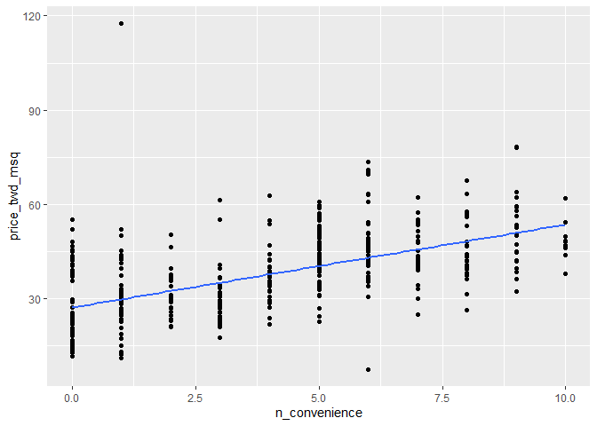
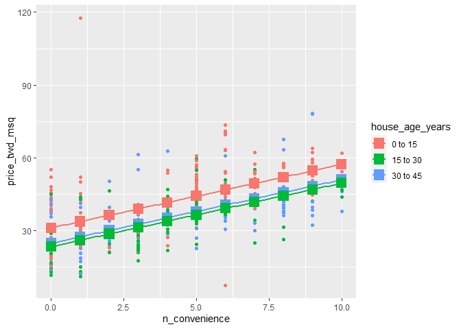
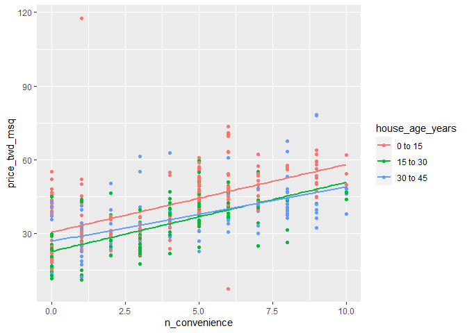
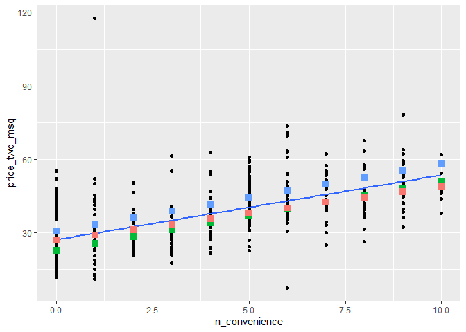

RealEstateAnalysis
================
Tanya Nayyar

``` r
library(dplyr)
library(ggplot2)
library(moderndive)
library(tidyr)
library(broom)
```

``` r
#set the working directory
setwd("C:/Users/TEMP/Documents")

#load real estate data into a dataframe
taiwan_re_data <- read.csv(file="RealEstateData.csv")
```

``` r
# view the top rows of the dataframe
head(taiwan_re_data)
```

    ##   transaction_date house_age_years dist_to_mrt_m n_convenience latitude
    ## 1         2012.917            32.0      84.87882            10 24.98298
    ## 2         2012.917            19.5     306.59470             9 24.98034
    ## 3         2013.583            13.3     561.98450             5 24.98746
    ## 4         2013.500            13.3     561.98450             5 24.98746
    ## 5         2012.833             5.0     390.56840             5 24.97937
    ## 6         2012.667             7.1    2175.03000             3 24.96305
    ##   longitude price_twd_msq
    ## 1  121.5402          37.9
    ## 2  121.5395          42.2
    ## 3  121.5439          47.3
    ## 4  121.5439          54.8
    ## 5  121.5425          43.1
    ## 6  121.5125          32.1

``` r
#copy data to sample df to add bucket column
taiwan_real_estate <- taiwan_re_data

#Divide and assign the age of the house, in years, into 3 groups.buckets
taiwan_real_estate$house_age_years_grp <- case_when(taiwan_re_data$house_age_years>=0 & taiwan_re_data$house_age_years < 15 ~"0 to 15"
                                 ,taiwan_re_data$house_age_years>=15 & taiwan_re_data$house_age_years < 30 ~"15 to 30"
                                 ,taiwan_re_data$house_age_years>=30 & taiwan_re_data$house_age_years <45 ~"30 to 45")
```

``` r
#renaming the columns
taiwan_real_estate <- taiwan_real_estate %>% 
  rename(
    orig_house_age_years = house_age_years,
    house_age_years = house_age_years_grp
  )
```

``` r
taiwan_real_estate
```

    ##     transaction_date orig_house_age_years dist_to_mrt_m n_convenience latitude
    ## 1           2012.917                 32.0      84.87882            10 24.98298
    ## 2           2012.917                 19.5     306.59470             9 24.98034
    ## 3           2013.583                 13.3     561.98450             5 24.98746
    ## 4           2013.500                 13.3     561.98450             5 24.98746
    ## 5           2012.833                  5.0     390.56840             5 24.97937
    ## 6           2012.667                  7.1    2175.03000             3 24.96305
    ## 7           2012.667                 34.5     623.47310             7 24.97933
    ## 8           2013.417                 20.3     287.60250             6 24.98042
    ## 9           2013.500                 31.7    5512.03800             1 24.95095
    ## 10          2013.417                 17.9    1783.18000             3 24.96731
    ## 11          2013.083                 34.8     405.21340             1 24.97349
    ## 12          2013.333                  6.3      90.45606             9 24.97433
    ## 13          2012.917                 13.0     492.23130             5 24.96515
    ## 14          2012.667                 20.4    2469.64500             4 24.96108
    ## 15          2013.500                 13.2    1164.83800             4 24.99156
    ## 16          2013.583                 35.7     579.20830             2 24.98240
    ## 17          2013.250                  0.0     292.99780             6 24.97744
    ## 18          2012.750                 17.7     350.85150             1 24.97544
    ## 19          2013.417                 16.9     368.13630             8 24.96750
    ## 20          2012.667                  1.5      23.38284             7 24.96772
    ## 21          2013.417                  4.5    2275.87700             3 24.96314
    ## 22          2013.417                 10.5     279.17260             7 24.97528
    ## 23          2012.917                 14.7    1360.13900             1 24.95204
    ## 24          2013.083                 10.1     279.17260             7 24.97528
    ## 25          2013.000                 39.6     480.69770             4 24.97353
    ## 26          2013.083                 29.3    1487.86800             2 24.97542
    ## 27          2012.667                  3.1     383.86240             5 24.98085
    ## 28          2013.250                 10.4     276.44900             5 24.95593
    ## 29          2013.500                 19.2     557.47800             4 24.97419
    ## 30          2013.083                  7.1     451.24380             5 24.97563
    ## 31          2013.500                 25.9    4519.69000             0 24.94826
    ## 32          2012.750                 29.6     769.40340             7 24.98281
    ## 33          2012.750                 37.9     488.57270             1 24.97349
    ## 34          2013.250                 16.5     323.65500             6 24.97841
    ## 35          2012.750                 15.4     205.36700             7 24.98419
    ## 36          2013.500                 13.9    4079.41800             0 25.01459
    ## 37          2012.917                 14.7    1935.00900             2 24.96386
    ## 38          2013.167                 12.0    1360.13900             1 24.95204
    ## 39          2012.667                  3.1     577.96150             6 24.97201
    ## 40          2013.167                 16.2     289.32480             5 24.98203
    ## 41          2013.000                 13.6    4082.01500             0 24.94155
    ## 42          2013.500                 16.8    4066.58700             0 24.94297
    ## 43          2013.417                 36.1     519.46170             5 24.96305
    ## 44          2012.750                 34.4     512.78710             6 24.98748
    ## 45          2013.583                  2.7     533.47620             4 24.97445
    ## 46          2013.083                 36.6     488.81930             8 24.97015
    ## 47          2013.417                 21.7     463.96230             9 24.97030
    ## 48          2013.583                 35.9     640.73910             3 24.97563
    ## 49          2013.417                 24.2    4605.74900             0 24.94684
    ## 50          2012.667                 29.4    4510.35900             1 24.94925
    ## 51          2013.417                 21.7     512.54870             4 24.97400
    ## 52          2013.083                 31.3    1758.40600             1 24.95402
    ## 53          2013.583                 32.1    1438.57900             3 24.97419
    ## 54          2013.083                 13.3     492.23130             5 24.96515
    ## 55          2013.083                 16.1     289.32480             5 24.98203
    ## 56          2012.833                 31.7    1160.63200             0 24.94968
    ## 57          2013.417                 33.6     371.24950             8 24.97254
    ## 58          2012.917                  3.5      56.47425             7 24.95744
    ## 59          2013.500                 30.3    4510.35900             1 24.94925
    ## 60          2013.083                 13.3     336.05320             5 24.95776
    ## 61          2013.417                 11.0    1931.20700             2 24.96365
    ## 62          2013.500                  5.3     259.66070             6 24.97585
    ## 63          2012.917                 17.2    2175.87700             3 24.96303
    ## 64          2013.583                  2.6     533.47620             4 24.97445
    ## 65          2013.333                 17.5     995.75540             0 24.96305
    ## 66          2013.417                 40.1     123.74290             8 24.97635
    ## 67          2013.000                  1.0     193.58450             6 24.96571
    ## 68          2013.500                  8.5     104.81010             5 24.96674
    ## 69          2013.417                 30.4     464.22300             6 24.97964
    ## 70          2012.833                 12.5     561.98450             5 24.98746
    ## 71          2013.583                  6.6      90.45606             9 24.97433
    ## 72          2013.083                 35.5     640.73910             3 24.97563
    ## 73          2013.583                 32.5     424.54420             8 24.97587
    ## 74          2013.167                 13.8    4082.01500             0 24.94155
    ## 75          2012.917                  6.8     379.55750            10 24.98343
    ## 76          2013.500                 12.3    1360.13900             1 24.95204
    ## 77          2013.583                 35.9     616.40040             3 24.97723
    ## 78          2012.833                 20.5    2185.12800             3 24.96322
    ## 79          2012.917                 38.2     552.43710             2 24.97598
    ## 80          2013.000                 18.0    1414.83700             1 24.95182
    ## 81          2013.500                 11.8     533.47620             4 24.97445
    ## 82          2013.000                 30.8     377.79560             6 24.96427
    ## 83          2013.083                 13.2     150.93470             7 24.96725
    ## 84          2012.917                 25.3    2707.39200             3 24.96056
    ## 85          2013.083                 15.1     383.28050             7 24.96735
    ## 86          2012.750                  0.0     338.96790             9 24.96853
    ## 87          2012.833                  1.8    1455.79800             1 24.95120
    ## 88          2013.583                 16.9    4066.58700             0 24.94297
    ## 89          2012.917                  8.9    1406.43000             0 24.98573
    ## 90          2013.500                 23.0    3947.94500             0 24.94783
    ## 91          2012.833                  0.0     274.01440             1 24.97480
    ## 92          2013.250                  9.1    1402.01600             0 24.98569
    ## 93          2012.917                 20.6    2469.64500             4 24.96108
    ## 94          2012.917                 31.9    1146.32900             0 24.94920
    ## 95          2012.917                 40.9     167.59890             5 24.96630
    ## 96          2012.917                  8.0     104.81010             5 24.96674
    ## 97          2013.417                  6.4      90.45606             9 24.97433
    ## 98          2013.083                 28.4     617.44240             3 24.97746
    ## 99          2013.417                 16.4     289.32480             5 24.98203
    ## 100         2013.417                  6.4      90.45606             9 24.97433
    ## 101         2013.500                 17.5     964.74960             4 24.98872
    ## 102         2012.833                 12.7     170.12890             1 24.97371
    ## 103         2013.083                  1.1     193.58450             6 24.96571
    ## 104         2012.750                  0.0     208.39050             6 24.95618
    ## 105         2012.667                 32.7     392.44590             6 24.96398
    ## 106         2012.833                  0.0     292.99780             6 24.97744
    ## 107         2013.083                 17.2     189.51810             8 24.97707
    ## 108         2013.333                 12.2    1360.13900             1 24.95204
    ## 109         2013.417                 31.4     592.50060             2 24.97260
    ## 110         2013.583                  4.0    2147.37600             3 24.96299
    ## 111         2013.083                  8.1     104.81010             5 24.96674
    ## 112         2013.583                 33.3     196.61720             7 24.97701
    ## 113         2013.417                  9.9    2102.42700             3 24.96044
    ## 114         2013.333                 14.8     393.26060             6 24.96172
    ## 115         2012.667                 30.6     143.83830             8 24.98155
    ## 116         2013.083                 20.6     737.91610             2 24.98092
    ## 117         2013.000                 30.9    6396.28300             1 24.94375
    ## 118         2013.000                 13.6    4197.34900             0 24.93885
    ## 119         2013.500                 25.3    1583.72200             3 24.96622
    ## 120         2013.500                 16.6     289.32480             5 24.98203
    ## 121         2013.167                 13.3     492.23130             5 24.96515
    ## 122         2013.500                 13.6     492.23130             5 24.96515
    ## 123         2013.250                 31.5     414.94760             4 24.98199
    ## 124         2013.417                  0.0     185.42960             0 24.97110
    ## 125         2012.917                  9.9     279.17260             7 24.97528
    ## 126         2013.167                  1.1     193.58450             6 24.96571
    ## 127         2013.083                 38.6     804.68970             4 24.97838
    ## 128         2013.250                  3.8     383.86240             5 24.98085
    ## 129         2013.083                 41.3     124.99120             6 24.96674
    ## 130         2013.417                 38.5     216.83290             7 24.98086
    ## 131         2013.250                 29.6     535.52700             8 24.98092
    ## 132         2013.500                  4.0    2147.37600             3 24.96299
    ## 133         2013.167                 26.6     482.75810             5 24.97433
    ## 134         2012.833                 18.0     373.39370             8 24.98660
    ## 135         2012.667                 33.4     186.96860             6 24.96604
    ## 136         2012.917                 18.9    1009.23500             0 24.96357
    ## 137         2012.750                 11.4     390.56840             5 24.97937
    ## 138         2013.500                 13.6     319.07080             6 24.96495
    ## 139         2013.167                 10.0     942.46640             0 24.97843
    ## 140         2012.667                 12.9     492.23130             5 24.96515
    ## 141         2013.250                 16.2     289.32480             5 24.98203
    ## 142         2013.333                  5.1    1559.82700             3 24.97213
    ## 143         2013.417                 19.8     640.60710             5 24.97017
    ## 144         2013.500                 13.6     492.23130             5 24.96515
    ## 145         2013.083                 11.9    1360.13900             1 24.95204
    ## 146         2012.917                  2.1     451.24380             5 24.97563
    ## 147         2012.750                  0.0     185.42960             0 24.97110
    ## 148         2012.750                  3.2     489.88210             8 24.97017
    ## 149         2013.500                 16.4    3780.59000             0 24.93293
    ## 150         2012.667                 34.9     179.45380             8 24.97349
    ## 151         2013.250                 35.8     170.73110             7 24.96719
    ## 152         2013.500                  4.9     387.77210             9 24.98118
    ## 153         2013.333                 12.0    1360.13900             1 24.95204
    ## 154         2013.250                  6.5     376.17090             6 24.95418
    ## 155         2013.500                 16.9    4066.58700             0 24.94297
    ## 156         2013.167                 13.8    4082.01500             0 24.94155
    ## 157         2013.583                 30.7    1264.73000             0 24.94883
    ## 158         2013.250                 16.1     815.93140             4 24.97886
    ## 159         2013.000                 11.6     390.56840             5 24.97937
    ## 160         2012.667                 15.5     815.93140             4 24.97886
    ## 161         2012.917                  3.5      49.66105             8 24.95836
    ## 162         2013.417                 19.2     616.40040             3 24.97723
    ## 163         2012.750                 16.0    4066.58700             0 24.94297
    ## 164         2013.500                  8.5     104.81010             5 24.96674
    ## 165         2012.833                  0.0     185.42960             0 24.97110
    ## 166         2012.917                 13.7    1236.56400             1 24.97694
    ## 167         2013.417                  0.0     292.99780             6 24.97744
    ## 168         2013.417                 28.2     330.08540             8 24.97408
    ## 169         2013.083                 27.6     515.11220             5 24.96299
    ## 170         2013.417                  8.4    1962.62800             1 24.95468
    ## 171         2013.333                 24.0    4527.68700             0 24.94741
    ## 172         2013.083                  3.6     383.86240             5 24.98085
    ## 173         2013.583                  6.6      90.45606             9 24.97433
    ## 174         2013.083                 41.3     401.88070             4 24.98326
    ## 175         2013.417                  4.3     432.03850             7 24.98050
    ## 176         2013.083                 30.2     472.17450             3 24.97005
    ## 177         2012.833                 13.9    4573.77900             0 24.94867
    ## 178         2013.083                 33.0     181.07660             9 24.97697
    ## 179         2013.500                 13.1    1144.43600             4 24.99176
    ## 180         2013.083                 14.0     438.85130             1 24.97493
    ## 181         2012.667                 26.9    4449.27000             0 24.94898
    ## 182         2013.167                 11.6     201.89390             8 24.98489
    ## 183         2013.500                 13.5    2147.37600             3 24.96299
    ## 184         2013.500                 17.0    4082.01500             0 24.94155
    ## 185         2012.750                 14.1    2615.46500             0 24.95495
    ## 186         2012.750                 31.4    1447.28600             3 24.97285
    ## 187         2013.167                 20.9    2185.12800             3 24.96322
    ## 188         2013.000                  8.9    3078.17600             0 24.95464
    ## 189         2012.917                 34.8     190.03920             8 24.97707
    ## 190         2012.917                 16.3    4066.58700             0 24.94297
    ## 191         2013.500                 35.3     616.57350             8 24.97945
    ## 192         2013.167                 13.2     750.07040             2 24.97371
    ## 193         2013.167                 43.8      57.58945             7 24.96750
    ## 194         2013.417                  9.7     421.47900             5 24.98246
    ## 195         2013.500                 15.2    3771.89500             0 24.93363
    ## 196         2013.333                 15.2     461.10160             5 24.95425
    ## 197         2013.000                 22.8     707.90670             2 24.98100
    ## 198         2013.250                 34.4     126.72860             8 24.96881
    ## 199         2013.083                 34.0     157.60520             7 24.96628
    ## 200         2013.417                 18.2     451.64190             8 24.96945
    ## 201         2013.417                 17.4     995.75540             0 24.96305
    ## 202         2013.417                 13.1     561.98450             5 24.98746
    ## 203         2012.917                 38.3     642.69850             3 24.97559
    ## 204         2012.667                 15.6     289.32480             5 24.98203
    ## 205         2013.000                 18.0    1414.83700             1 24.95182
    ## 206         2013.083                 12.8    1449.72200             3 24.97289
    ## 207         2013.250                 22.2     379.55750            10 24.98343
    ## 208         2013.083                 38.5     665.06360             3 24.97503
    ## 209         2012.750                 11.5    1360.13900             1 24.95204
    ## 210         2012.833                 34.8     175.62940             8 24.97347
    ## 211         2013.500                  5.2     390.56840             5 24.97937
    ## 212         2013.083                  0.0     274.01440             1 24.97480
    ## 213         2013.333                 17.6    1805.66500             2 24.98672
    ## 214         2013.083                  6.2      90.45606             9 24.97433
    ## 215         2013.583                 18.1    1783.18000             3 24.96731
    ## 216         2013.333                 19.2     383.71290             8 24.97200
    ## 217         2013.250                 37.8     590.92920             1 24.97153
    ## 218         2012.917                 28.0     372.62420             6 24.97838
    ## 219         2013.417                 13.6     492.23130             5 24.96515
    ## 220         2012.750                 29.3     529.77710             8 24.98102
    ## 221         2013.333                 37.2     186.51010             9 24.97703
    ## 222         2013.333                  9.0    1402.01600             0 24.98569
    ## 223         2013.583                 30.6     431.11140            10 24.98123
    ## 224         2013.250                  9.1    1402.01600             0 24.98569
    ## 225         2013.333                 34.5     324.94190             6 24.97814
    ## 226         2013.250                  1.1     193.58450             6 24.96571
    ## 227         2013.000                 16.5    4082.01500             0 24.94155
    ## 228         2012.917                 32.4     265.06090             8 24.98059
    ## 229         2013.417                 11.9    3171.32900             0 25.00115
    ## 230         2013.583                 31.0    1156.41200             0 24.94890
    ## 231         2013.500                  4.0    2147.37600             3 24.96299
    ## 232         2012.833                 16.2    4074.73600             0 24.94235
    ## 233         2012.917                 27.1    4412.76500             1 24.95032
    ## 234         2013.333                 39.7     333.36790             9 24.98016
    ## 235         2013.250                  8.0    2216.61200             4 24.96007
    ## 236         2012.750                 12.9     250.63100             7 24.96606
    ## 237         2013.167                  3.6     373.83890            10 24.98322
    ## 238         2013.167                 13.0     732.85280             0 24.97668
    ## 239         2013.083                 12.8     732.85280             0 24.97668
    ## 240         2013.500                 18.1     837.72330             0 24.96334
    ## 241         2013.083                 11.0    1712.63200             2 24.96412
    ## 242         2013.500                 13.7     250.63100             7 24.96606
    ## 243         2012.833                  2.0    2077.39000             3 24.96357
    ## 244         2013.417                 32.8     204.17050             8 24.98236
    ## 245         2013.083                  4.8    1559.82700             3 24.97213
    ## 246         2013.417                  7.5     639.61980             5 24.97258
    ## 247         2013.417                 16.4     389.82190             6 24.96412
    ## 248         2013.333                 21.7    1055.06700             0 24.96211
    ## 249         2013.000                 19.0    1009.23500             0 24.96357
    ## 250         2012.833                 18.0    6306.15300             1 24.95743
    ## 251         2013.167                 39.2     424.71320             7 24.97429
    ## 252         2012.917                 31.7    1159.45400             0 24.94960
    ## 253         2012.833                  5.9      90.45606             9 24.97433
    ## 254         2012.667                 30.4    1735.59500             2 24.96464
    ## 255         2012.667                  1.1     329.97470             5 24.98254
    ## 256         2013.417                 31.5    5512.03800             1 24.95095
    ## 257         2012.667                 14.6     339.22890             1 24.97519
    ## 258         2013.250                 17.3     444.13340             1 24.97501
    ## 259         2013.417                  0.0     292.99780             6 24.97744
    ## 260         2013.083                 17.7     837.72330             0 24.96334
    ## 261         2013.250                 17.0    1485.09700             4 24.97073
    ## 262         2013.167                 16.2    2288.01100             3 24.95885
    ## 263         2012.917                 15.9     289.32480             5 24.98203
    ## 264         2013.417                  3.9    2147.37600             3 24.96299
    ## 265         2013.167                 32.6     493.65700             7 24.96968
    ## 266         2012.833                 15.7     815.93140             4 24.97886
    ## 267         2013.250                 17.8    1783.18000             3 24.96731
    ## 268         2012.833                 34.7     482.75810             5 24.97433
    ## 269         2013.417                 17.2     390.56840             5 24.97937
    ## 270         2013.000                 17.6     837.72330             0 24.96334
    ## 271         2013.333                 10.8     252.58220             1 24.97460
    ## 272         2012.917                 17.7     451.64190             8 24.96945
    ## 273         2012.750                 13.0     492.23130             5 24.96515
    ## 274         2013.417                 13.2     170.12890             1 24.97371
    ## 275         2013.167                 27.5     394.01730             7 24.97305
    ## 276         2012.667                  1.5      23.38284             7 24.96772
    ## 277         2013.000                 19.1     461.10160             5 24.95425
    ## 278         2013.417                 21.2    2185.12800             3 24.96322
    ## 279         2012.750                  0.0     208.39050             6 24.95618
    ## 280         2013.417                  2.6    1554.25000             3 24.97026
    ## 281         2013.250                  2.3     184.33020             6 24.96581
    ## 282         2013.333                  4.7     387.77210             9 24.98118
    ## 283         2012.917                  2.0    1455.79800             1 24.95120
    ## 284         2013.417                 33.5    1978.67100             2 24.98674
    ## 285         2012.917                 15.0     383.28050             7 24.96735
    ## 286         2013.167                 30.1     718.29370             3 24.97509
    ## 287         2012.917                  5.9      90.45606             9 24.97433
    ## 288         2013.000                 19.2     461.10160             5 24.95425
    ## 289         2013.583                 16.6     323.69120             6 24.97841
    ## 290         2013.333                 13.9     289.32480             5 24.98203
    ## 291         2013.083                 37.7     490.34460             0 24.97217
    ## 292         2012.833                  3.4      56.47425             7 24.95744
    ## 293         2013.083                 17.5     395.67470             5 24.95674
    ## 294         2012.667                 12.6     383.28050             7 24.96735
    ## 295         2013.500                 26.4     335.52730             6 24.97960
    ## 296         2013.167                 18.2    2179.59000             3 24.96299
    ## 297         2012.750                 12.5    1144.43600             4 24.99176
    ## 298         2012.833                 34.9     567.03490             4 24.97003
    ## 299         2013.333                 16.7    4082.01500             0 24.94155
    ## 300         2013.167                 33.2     121.72620            10 24.98178
    ## 301         2013.083                  2.5     156.24420             4 24.96696
    ## 302         2012.750                 38.0     461.78480             0 24.97229
    ## 303         2013.500                 16.5    2288.01100             3 24.95885
    ## 304         2013.500                 38.3     439.71050             0 24.97161
    ## 305         2013.417                 20.0    1626.08300             3 24.96622
    ## 306         2013.083                 16.2     289.32480             5 24.98203
    ## 307         2013.500                 14.4     169.98030             1 24.97369
    ## 308         2012.833                 10.3    3079.89000             0 24.95460
    ## 309         2013.417                 16.4     289.32480             5 24.98203
    ## 310         2013.250                 30.3    1264.73000             0 24.94883
    ## 311         2013.583                 16.4    1643.49900             2 24.95394
    ## 312         2013.167                 21.3     537.79710             4 24.97425
    ## 313         2013.583                 35.4     318.52920             9 24.97071
    ## 314         2013.333                  8.3     104.81010             5 24.96674
    ## 315         2013.250                  3.7     577.96150             6 24.97201
    ## 316         2013.083                 15.6    1756.41100             2 24.98320
    ## 317         2013.250                 13.3     250.63100             7 24.96606
    ## 318         2012.750                 15.6     752.76690             2 24.97795
    ## 319         2013.333                  7.1     379.55750            10 24.98343
    ## 320         2013.250                 34.6     272.67830             5 24.95562
    ## 321         2012.750                 13.5    4197.34900             0 24.93885
    ## 322         2012.917                 16.9     964.74960             4 24.98872
    ## 323         2013.000                 12.9     187.48230             1 24.97388
    ## 324         2013.417                 28.6     197.13380             6 24.97631
    ## 325         2012.667                 12.4    1712.63200             2 24.96412
    ## 326         2013.083                 36.6     488.81930             8 24.97015
    ## 327         2013.500                  4.1      56.47425             7 24.95744
    ## 328         2013.417                  3.5     757.33770             3 24.97538
    ## 329         2012.833                 15.9    1497.71300             3 24.97003
    ## 330         2013.000                 13.6    4197.34900             0 24.93885
    ## 331         2013.083                 32.0    1156.77700             0 24.94935
    ## 332         2013.333                 25.6    4519.69000             0 24.94826
    ## 333         2013.167                 39.8     617.71340             2 24.97577
    ## 334         2012.750                  7.8     104.81010             5 24.96674
    ## 335         2012.917                 30.0    1013.34100             5 24.99006
    ## 336         2013.583                 27.3     337.60160             6 24.96431
    ## 337         2012.833                  5.1    1867.23300             2 24.98407
    ## 338         2012.833                 31.3     600.86040             5 24.96871
    ## 339         2012.917                 31.5     258.18600             9 24.96867
    ## 340         2013.333                  1.7     329.97470             5 24.98254
    ## 341         2013.333                 33.6     270.88950             0 24.97281
    ## 342         2013.000                 13.0     750.07040             2 24.97371
    ## 343         2012.667                  5.7      90.45606             9 24.97433
    ## 344         2013.000                 33.5     563.28540             8 24.98223
    ## 345         2013.500                 34.6    3085.17000             0 24.99800
    ## 346         2012.667                  0.0     185.42960             0 24.97110
    ## 347         2013.417                 13.2    1712.63200             2 24.96412
    ## 348         2013.583                 17.4    6488.02100             1 24.95719
    ## 349         2012.833                  4.6     259.66070             6 24.97585
    ## 350         2012.750                  7.8     104.81010             5 24.96674
    ## 351         2013.000                 13.2     492.23130             5 24.96515
    ## 352         2012.833                  4.0    2180.24500             3 24.96324
    ## 353         2012.833                 18.4    2674.96100             3 24.96143
    ## 354         2013.500                  4.1    2147.37600             3 24.96299
    ## 355         2013.417                 12.2    1360.13900             1 24.95204
    ## 356         2013.250                  3.8     383.86240             5 24.98085
    ## 357         2012.833                 10.3     211.44730             1 24.97417
    ## 358         2013.417                  0.0     338.96790             9 24.96853
    ## 359         2013.167                  1.1     193.58450             6 24.96571
    ## 360         2013.500                  5.6    2408.99300             0 24.95505
    ## 361         2012.667                 32.9      87.30222            10 24.98300
    ## 362         2013.083                 41.4     281.20500             8 24.97345
    ## 363         2013.417                 17.1     967.40000             4 24.98872
    ## 364         2013.500                 32.3     109.94550            10 24.98182
    ## 365         2013.417                 35.3     614.13940             7 24.97913
    ## 366         2012.917                 17.3    2261.43200             4 24.96182
    ## 367         2012.750                 14.2    1801.54400             1 24.95153
    ## 368         2012.833                 15.0    1828.31900             2 24.96464
    ## 369         2013.417                 18.2     350.85150             1 24.97544
    ## 370         2012.667                 20.2    2185.12800             3 24.96322
    ## 371         2012.750                 15.9     289.32480             5 24.98203
    ## 372         2013.500                  4.1     312.89630             5 24.95591
    ## 373         2013.000                 33.9     157.60520             7 24.96628
    ## 374         2013.083                  0.0     274.01440             1 24.97480
    ## 375         2013.250                  5.4     390.56840             5 24.97937
    ## 376         2013.250                 21.7    1157.98800             0 24.96165
    ## 377         2013.417                 14.7    1717.19300             2 24.96447
    ## 378         2013.333                  3.9      49.66105             8 24.95836
    ## 379         2013.333                 37.3     587.88770             8 24.97077
    ## 380         2013.333                  0.0     292.99780             6 24.97744
    ## 381         2013.333                 14.1     289.32480             5 24.98203
    ## 382         2013.417                  8.0     132.54690             9 24.98298
    ## 383         2013.000                 16.3    3529.56400             0 24.93207
    ## 384         2012.667                 29.1     506.11440             4 24.97845
    ## 385         2012.750                 16.1    4066.58700             0 24.94297
    ## 386         2013.000                 18.3      82.88643            10 24.98300
    ## 387         2012.833                  0.0     185.42960             0 24.97110
    ## 388         2013.250                 16.2    2103.55500             3 24.96042
    ## 389         2013.500                 10.4    2251.93800             4 24.95957
    ## 390         2013.250                 40.9     122.36190             8 24.96756
    ## 391         2013.500                 32.8     377.83020             9 24.97151
    ## 392         2013.583                  6.2    1939.74900             1 24.95155
    ## 393         2013.083                 42.7     443.80200             6 24.97927
    ## 394         2013.000                 16.9     967.40000             4 24.98872
    ## 395         2013.500                 32.6    4136.27100             1 24.95544
    ## 396         2012.917                 21.2     512.54870             4 24.97400
    ## 397         2012.667                 37.1     918.63570             1 24.97198
    ## 398         2013.417                 13.1    1164.83800             4 24.99156
    ## 399         2013.417                 14.7    1717.19300             2 24.96447
    ## 400         2012.917                 12.7     170.12890             1 24.97371
    ## 401         2013.250                 26.8     482.75810             5 24.97433
    ## 402         2013.083                  7.6    2175.03000             3 24.96305
    ## 403         2012.833                 12.7     187.48230             1 24.97388
    ## 404         2012.667                 30.9     161.94200             9 24.98353
    ## 405         2013.333                 16.4     289.32480             5 24.98203
    ## 406         2012.667                 23.0     130.99450             6 24.95663
    ## 407         2013.167                  1.9     372.13860             7 24.97293
    ## 408         2013.000                  5.2    2408.99300             0 24.95505
    ## 409         2013.417                 18.5    2175.74400             3 24.96330
    ## 410         2013.000                 13.7    4082.01500             0 24.94155
    ## 411         2012.667                  5.6      90.45606             9 24.97433
    ## 412         2013.250                 18.8     390.96960             7 24.97923
    ## 413         2013.000                  8.1     104.81010             5 24.96674
    ## 414         2013.500                  6.5      90.45606             9 24.97433
    ##     longitude price_twd_msq house_age_years
    ## 1    121.5402          37.9        30 to 45
    ## 2    121.5395          42.2        15 to 30
    ## 3    121.5439          47.3         0 to 15
    ## 4    121.5439          54.8         0 to 15
    ## 5    121.5425          43.1         0 to 15
    ## 6    121.5125          32.1         0 to 15
    ## 7    121.5364          40.3        30 to 45
    ## 8    121.5423          46.7        15 to 30
    ## 9    121.4846          18.8        30 to 45
    ## 10   121.5149          22.1        15 to 30
    ## 11   121.5337          41.4        30 to 45
    ## 12   121.5431          58.1         0 to 15
    ## 13   121.5374          39.3         0 to 15
    ## 14   121.5105          23.8        15 to 30
    ## 15   121.5341          34.3         0 to 15
    ## 16   121.5462          50.5        30 to 45
    ## 17   121.5446          70.1         0 to 15
    ## 18   121.5312          37.4        15 to 30
    ## 19   121.5445          42.3        15 to 30
    ## 20   121.5410          47.7         0 to 15
    ## 21   121.5115          29.3         0 to 15
    ## 22   121.5454          51.6         0 to 15
    ## 23   121.5484          24.6         0 to 15
    ## 24   121.5454          47.9         0 to 15
    ## 25   121.5388          38.8        30 to 45
    ## 26   121.5173          27.0        15 to 30
    ## 27   121.5439          56.2         0 to 15
    ## 28   121.5391          33.6         0 to 15
    ## 29   121.5380          47.0        15 to 30
    ## 30   121.5469          57.1         0 to 15
    ## 31   121.4959          22.1        15 to 30
    ## 32   121.5341          25.0        15 to 30
    ## 33   121.5345          34.2        30 to 45
    ## 34   121.5428          49.3        15 to 30
    ## 35   121.5424          55.1        15 to 30
    ## 36   121.5182          27.3         0 to 15
    ## 37   121.5146          22.9         0 to 15
    ## 38   121.5484          25.3         0 to 15
    ## 39   121.5472          47.7         0 to 15
    ## 40   121.5435          46.2        15 to 30
    ## 41   121.5038          15.9         0 to 15
    ## 42   121.5034          18.2        15 to 30
    ## 43   121.5376          34.7        30 to 45
    ## 44   121.5430          34.1        30 to 45
    ## 45   121.5477          53.9         0 to 15
    ## 46   121.5449          38.3        30 to 45
    ## 47   121.5446          42.0        15 to 30
    ## 48   121.5371          61.5        30 to 45
    ## 49   121.4958          13.4        15 to 30
    ## 50   121.4954          13.2        15 to 30
    ## 51   121.5384          44.2        15 to 30
    ## 52   121.5528          20.7        30 to 45
    ## 53   121.5175          27.0        30 to 45
    ## 54   121.5374          38.9         0 to 15
    ## 55   121.5435          51.7        15 to 30
    ## 56   121.5301          13.7        30 to 45
    ## 57   121.5406          41.9        30 to 45
    ## 58   121.5371          53.5         0 to 15
    ## 59   121.4954          22.6        30 to 45
    ## 60   121.5344          42.4         0 to 15
    ## 61   121.5147          21.3         0 to 15
    ## 62   121.5452          63.2         0 to 15
    ## 63   121.5125          27.7        15 to 30
    ## 64   121.5477          55.0         0 to 15
    ## 65   121.5491          25.3        15 to 30
    ## 66   121.5433          44.3        30 to 45
    ## 67   121.5409          50.7         0 to 15
    ## 68   121.5407          56.8         0 to 15
    ## 69   121.5380          36.2        30 to 45
    ## 70   121.5439          42.0         0 to 15
    ## 71   121.5431          59.0         0 to 15
    ## 72   121.5371          40.8        30 to 45
    ## 73   121.5391          36.3        30 to 45
    ## 74   121.5038          20.0         0 to 15
    ## 75   121.5376          54.4         0 to 15
    ## 76   121.5484          29.5         0 to 15
    ## 77   121.5377          36.8        30 to 45
    ## 78   121.5124          25.6        15 to 30
    ## 79   121.5338          29.8        30 to 45
    ## 80   121.5489          26.5        15 to 30
    ## 81   121.5477          40.3         0 to 15
    ## 82   121.5396          36.8        30 to 45
    ## 83   121.5425          48.1         0 to 15
    ## 84   121.5083          17.7        15 to 30
    ## 85   121.5446          43.7        15 to 30
    ## 86   121.5441          50.8         0 to 15
    ## 87   121.5490          27.0         0 to 15
    ## 88   121.5034          18.3        15 to 30
    ## 89   121.5276          48.0         0 to 15
    ## 90   121.5024          25.3        15 to 30
    ## 91   121.5306          45.4         0 to 15
    ## 92   121.5276          43.2         0 to 15
    ## 93   121.5105          21.8        15 to 30
    ## 94   121.5308          16.1        30 to 45
    ## 95   121.5403          41.0        30 to 45
    ## 96   121.5407          51.8         0 to 15
    ## 97   121.5431          59.5         0 to 15
    ## 98   121.5330          34.6        15 to 30
    ## 99   121.5435          51.0        15 to 30
    ## 100  121.5431          62.2         0 to 15
    ## 101  121.5341          38.2        15 to 30
    ## 102  121.5298          32.9         0 to 15
    ## 103  121.5409          54.4         0 to 15
    ## 104  121.5384          45.7         0 to 15
    ## 105  121.5425          30.5        30 to 45
    ## 106  121.5446          71.0         0 to 15
    ## 107  121.5431          47.1        15 to 30
    ## 108  121.5484          26.6         0 to 15
    ## 109  121.5356          34.1        30 to 45
    ## 110  121.5128          28.4         0 to 15
    ## 111  121.5407          51.6         0 to 15
    ## 112  121.5422          39.4        30 to 45
    ## 113  121.5146          23.1         0 to 15
    ## 114  121.5381           7.6         0 to 15
    ## 115  121.5414          53.3        30 to 45
    ## 116  121.5474          46.4        15 to 30
    ## 117  121.4788          12.2        30 to 45
    ## 118  121.5038          13.0         0 to 15
    ## 119  121.5171          30.6        15 to 30
    ## 120  121.5435          59.6        15 to 30
    ## 121  121.5374          31.3         0 to 15
    ## 122  121.5374          48.0         0 to 15
    ## 123  121.5446          32.5        30 to 45
    ## 124  121.5317          45.5         0 to 15
    ## 125  121.5454          57.4         0 to 15
    ## 126  121.5409          48.6         0 to 15
    ## 127  121.5348          62.9        30 to 45
    ## 128  121.5439          55.0         0 to 15
    ## 129  121.5404          60.7        30 to 45
    ## 130  121.5416          41.0        30 to 45
    ## 131  121.5365          37.5        15 to 30
    ## 132  121.5128          30.7         0 to 15
    ## 133  121.5386          37.5        15 to 30
    ## 134  121.5408          39.5        15 to 30
    ## 135  121.5421          42.2        30 to 45
    ## 136  121.5495          20.8        15 to 30
    ## 137  121.5425          46.8         0 to 15
    ## 138  121.5428          47.4         0 to 15
    ## 139  121.5241          43.5         0 to 15
    ## 140  121.5374          42.5         0 to 15
    ## 141  121.5435          51.4        15 to 30
    ## 142  121.5163          28.9         0 to 15
    ## 143  121.5465          37.5        15 to 30
    ## 144  121.5374          40.1         0 to 15
    ## 145  121.5484          28.4         0 to 15
    ## 146  121.5469          45.5         0 to 15
    ## 147  121.5317          52.2         0 to 15
    ## 148  121.5449          43.2         0 to 15
    ## 149  121.5120          45.1        15 to 30
    ## 150  121.5425          39.7        30 to 45
    ## 151  121.5427          48.5        30 to 45
    ## 152  121.5379          44.7         0 to 15
    ## 153  121.5484          28.9         0 to 15
    ## 154  121.5371          40.9         0 to 15
    ## 155  121.5034          20.7        15 to 30
    ## 156  121.5038          15.6         0 to 15
    ## 157  121.5295          18.3        30 to 45
    ## 158  121.5346          35.6        15 to 30
    ## 159  121.5425          39.4         0 to 15
    ## 160  121.5346          37.4        15 to 30
    ## 161  121.5376          57.8         0 to 15
    ## 162  121.5377          39.6        15 to 30
    ## 163  121.5034          11.6        15 to 30
    ## 164  121.5407          55.5         0 to 15
    ## 165  121.5317          55.2         0 to 15
    ## 166  121.5539          30.6         0 to 15
    ## 167  121.5446          73.6         0 to 15
    ## 168  121.5401          43.4        15 to 30
    ## 169  121.5432          37.4        15 to 30
    ## 170  121.5548          23.5         0 to 15
    ## 171  121.4963          14.4        15 to 30
    ## 172  121.5439          58.8         0 to 15
    ## 173  121.5431          58.1         0 to 15
    ## 174  121.5446          35.1        30 to 45
    ## 175  121.5378          45.2         0 to 15
    ## 176  121.5376          36.5        30 to 45
    ## 177  121.4951          19.2         0 to 15
    ## 178  121.5426          42.0        30 to 45
    ## 179  121.5346          36.7         0 to 15
    ## 180  121.5273          42.6         0 to 15
    ## 181  121.4962          15.5        15 to 30
    ## 182  121.5412          55.9         0 to 15
    ## 183  121.5128          23.6         0 to 15
    ## 184  121.5038          18.8        15 to 30
    ## 185  121.5617          21.8         0 to 15
    ## 186  121.5173          21.5        30 to 45
    ## 187  121.5124          25.7        15 to 30
    ## 188  121.5663          22.0         0 to 15
    ## 189  121.5431          44.3        30 to 45
    ## 190  121.5034          20.5        15 to 30
    ## 191  121.5364          42.3        30 to 45
    ## 192  121.5495          37.8         0 to 15
    ## 193  121.5407          42.7        30 to 45
    ## 194  121.5448          49.3         0 to 15
    ## 195  121.5116          29.3        15 to 30
    ## 196  121.5399          34.6        15 to 30
    ## 197  121.5471          36.6        15 to 30
    ## 198  121.5409          48.2        30 to 45
    ## 199  121.5420          39.1        30 to 45
    ## 200  121.5449          31.6        15 to 30
    ## 201  121.5491          25.5        15 to 30
    ## 202  121.5439          45.9         0 to 15
    ## 203  121.5371          31.5        30 to 45
    ## 204  121.5435          46.1        15 to 30
    ## 205  121.5489          26.6        15 to 30
    ## 206  121.5173          21.4         0 to 15
    ## 207  121.5376          44.0        15 to 30
    ## 208  121.5369          34.2        30 to 45
    ## 209  121.5484          26.2         0 to 15
    ## 210  121.5427          40.9        30 to 45
    ## 211  121.5425          52.2         0 to 15
    ## 212  121.5306          43.5         0 to 15
    ## 213  121.5209          31.1        15 to 30
    ## 214  121.5431          58.0         0 to 15
    ## 215  121.5149          20.9        15 to 30
    ## 216  121.5448          48.1        15 to 30
    ## 217  121.5356          39.7        30 to 45
    ## 218  121.5412          40.8        15 to 30
    ## 219  121.5374          43.8         0 to 15
    ## 220  121.5366          40.2        15 to 30
    ## 221  121.5426          78.3        30 to 45
    ## 222  121.5276          38.5         0 to 15
    ## 223  121.5374          48.5        30 to 45
    ## 224  121.5276          42.3         0 to 15
    ## 225  121.5417          46.0        30 to 45
    ## 226  121.5409          49.0         0 to 15
    ## 227  121.5038          12.8        15 to 30
    ## 228  121.5399          40.2        30 to 45
    ## 229  121.5178          46.6         0 to 15
    ## 230  121.5310          19.0        30 to 45
    ## 231  121.5128          33.4         0 to 15
    ## 232  121.5036          14.7        15 to 30
    ## 233  121.4959          17.4        15 to 30
    ## 234  121.5393          32.4        30 to 45
    ## 235  121.5136          23.9         0 to 15
    ## 236  121.5430          39.3         0 to 15
    ## 237  121.5376          61.9         0 to 15
    ## 238  121.5252          39.0         0 to 15
    ## 239  121.5252          40.6         0 to 15
    ## 240  121.5477          29.7        15 to 30
    ## 241  121.5167          28.8         0 to 15
    ## 242  121.5430          41.4         0 to 15
    ## 243  121.5133          33.4         0 to 15
    ## 244  121.5392          48.2        30 to 45
    ## 245  121.5163          21.7         0 to 15
    ## 246  121.5481          40.8         0 to 15
    ## 247  121.5427          40.6        15 to 30
    ## 248  121.5493          23.1        15 to 30
    ## 249  121.5495          22.3        15 to 30
    ## 250  121.4752          15.0        15 to 30
    ## 251  121.5392          30.0        30 to 45
    ## 252  121.5302          13.8        30 to 45
    ## 253  121.5431          52.7         0 to 15
    ## 254  121.5162          25.9        30 to 45
    ## 255  121.5439          51.8         0 to 15
    ## 256  121.4846          17.4        30 to 45
    ## 257  121.5315          26.5         0 to 15
    ## 258  121.5273          43.9        15 to 30
    ## 259  121.5446          63.3         0 to 15
    ## 260  121.5477          28.8        15 to 30
    ## 261  121.5170          30.7        15 to 30
    ## 262  121.5136          24.4        15 to 30
    ## 263  121.5435          53.0        15 to 30
    ## 264  121.5128          31.7         0 to 15
    ## 265  121.5452          40.6        30 to 45
    ## 266  121.5346          38.1        15 to 30
    ## 267  121.5149          23.7        15 to 30
    ## 268  121.5386          41.1        30 to 45
    ## 269  121.5425          40.1        15 to 30
    ## 270  121.5477          23.0        15 to 30
    ## 271  121.5305         117.5         0 to 15
    ## 272  121.5449          26.5        15 to 30
    ## 273  121.5374          40.5         0 to 15
    ## 274  121.5298          29.3         0 to 15
    ## 275  121.5399          41.0        15 to 30
    ## 276  121.5410          49.7         0 to 15
    ## 277  121.5399          34.0        15 to 30
    ## 278  121.5124          27.7        15 to 30
    ## 279  121.5384          44.0         0 to 15
    ## 280  121.5164          31.1         0 to 15
    ## 281  121.5409          45.4         0 to 15
    ## 282  121.5379          44.8         0 to 15
    ## 283  121.5490          25.6         0 to 15
    ## 284  121.5184          23.5        30 to 45
    ## 285  121.5446          34.4        15 to 30
    ## 286  121.5364          55.3        30 to 45
    ## 287  121.5431          56.3         0 to 15
    ## 288  121.5399          32.9        15 to 30
    ## 289  121.5428          51.0        15 to 30
    ## 290  121.5435          44.5         0 to 15
    ## 291  121.5347          37.0        30 to 45
    ## 292  121.5371          54.4         0 to 15
    ## 293  121.5340          24.5        15 to 30
    ## 294  121.5446          42.5         0 to 15
    ## 295  121.5414          38.1        15 to 30
    ## 296  121.5125          21.8        15 to 30
    ## 297  121.5346          34.1         0 to 15
    ## 298  121.5458          28.5        30 to 45
    ## 299  121.5038          16.7        15 to 30
    ## 300  121.5406          46.1        30 to 45
    ## 301  121.5399          36.9         0 to 15
    ## 302  121.5345          35.7        30 to 45
    ## 303  121.5136          23.2        15 to 30
    ## 304  121.5342          38.4        30 to 45
    ## 305  121.5167          29.4        15 to 30
    ## 306  121.5435          55.0        15 to 30
    ## 307  121.5298          50.2         0 to 15
    ## 308  121.5663          24.7         0 to 15
    ## 309  121.5435          53.0        15 to 30
    ## 310  121.5295          19.1        30 to 45
    ## 311  121.5517          24.7        15 to 30
    ## 312  121.5381          42.2        15 to 30
    ## 313  121.5407          78.0        30 to 45
    ## 314  121.5407          42.8         0 to 15
    ## 315  121.5472          41.6         0 to 15
    ## 316  121.5181          27.3        15 to 30
    ## 317  121.5430          42.0         0 to 15
    ## 318  121.5345          37.5        15 to 30
    ## 319  121.5376          49.8         0 to 15
    ## 320  121.5387          26.9        30 to 45
    ## 321  121.5038          18.6         0 to 15
    ## 322  121.5341          37.7        15 to 30
    ## 323  121.5298          33.1         0 to 15
    ## 324  121.5444          42.5        15 to 30
    ## 325  121.5167          31.3         0 to 15
    ## 326  121.5449          38.1        30 to 45
    ## 327  121.5371          62.1         0 to 15
    ## 328  121.5497          36.7         0 to 15
    ## 329  121.5170          23.6        15 to 30
    ## 330  121.5038          19.2         0 to 15
    ## 331  121.5305          12.8        30 to 45
    ## 332  121.4959          15.6        15 to 30
    ## 333  121.5348          39.6        30 to 45
    ## 334  121.5407          38.4         0 to 15
    ## 335  121.5346          22.8        30 to 45
    ## 336  121.5406          36.5        15 to 30
    ## 337  121.5175          35.6         0 to 15
    ## 338  121.5465          30.9        30 to 45
    ## 339  121.5433          36.3        30 to 45
    ## 340  121.5439          50.4         0 to 15
    ## 341  121.5327          42.9        30 to 45
    ## 342  121.5495          37.0         0 to 15
    ## 343  121.5431          53.5         0 to 15
    ## 344  121.5360          46.6        30 to 45
    ## 345  121.5155          41.2        30 to 45
    ## 346  121.5317          37.9         0 to 15
    ## 347  121.5167          30.8         0 to 15
    ## 348  121.4735          11.2        15 to 30
    ## 349  121.5452          53.7         0 to 15
    ## 350  121.5407          47.0         0 to 15
    ## 351  121.5374          42.3         0 to 15
    ## 352  121.5124          28.6         0 to 15
    ## 353  121.5083          25.7        15 to 30
    ## 354  121.5128          31.3         0 to 15
    ## 355  121.5484          30.1         0 to 15
    ## 356  121.5439          60.7         0 to 15
    ## 357  121.5300          45.3         0 to 15
    ## 358  121.5441          44.9         0 to 15
    ## 359  121.5409          45.1         0 to 15
    ## 360  121.5596          24.7         0 to 15
    ## 361  121.5402          47.1        30 to 45
    ## 362  121.5409          63.3        30 to 45
    ## 363  121.5341          40.0        15 to 30
    ## 364  121.5409          48.0        30 to 45
    ## 365  121.5367          33.1        30 to 45
    ## 366  121.5122          29.5        15 to 30
    ## 367  121.5525          24.8         0 to 15
    ## 368  121.5153          20.9        15 to 30
    ## 369  121.5312          43.1        15 to 30
    ## 370  121.5124          22.8        15 to 30
    ## 371  121.5435          42.1        15 to 30
    ## 372  121.5396          51.7         0 to 15
    ## 373  121.5420          41.5        30 to 45
    ## 374  121.5306          52.2         0 to 15
    ## 375  121.5425          49.5         0 to 15
    ## 376  121.5501          23.8        15 to 30
    ## 377  121.5165          30.5         0 to 15
    ## 378  121.5376          56.8         0 to 15
    ## 379  121.5463          37.4        30 to 45
    ## 380  121.5446          69.7         0 to 15
    ## 381  121.5435          53.3         0 to 15
    ## 382  121.5398          47.3         0 to 15
    ## 383  121.5160          29.3        15 to 30
    ## 384  121.5389          40.3        15 to 30
    ## 385  121.5034          12.9        15 to 30
    ## 386  121.5403          46.6        15 to 30
    ## 387  121.5317          55.3         0 to 15
    ## 388  121.5146          25.6        15 to 30
    ## 389  121.5135          27.3         0 to 15
    ## 390  121.5423          67.7        30 to 45
    ## 391  121.5435          38.6        30 to 45
    ## 392  121.5539          31.3         0 to 15
    ## 393  121.5387          35.3        30 to 45
    ## 394  121.5341          40.3        15 to 30
    ## 395  121.4963          24.7        30 to 45
    ## 396  121.5384          42.5        15 to 30
    ## 397  121.5506          31.9        30 to 45
    ## 398  121.5341          32.2         0 to 15
    ## 399  121.5165          23.0         0 to 15
    ## 400  121.5298          37.3         0 to 15
    ## 401  121.5386          35.5        15 to 30
    ## 402  121.5125          27.7         0 to 15
    ## 403  121.5298          28.5         0 to 15
    ## 404  121.5397          39.7        30 to 45
    ## 405  121.5435          41.2        15 to 30
    ## 406  121.5376          37.2        15 to 30
    ## 407  121.5403          40.5         0 to 15
    ## 408  121.5596          22.3         0 to 15
    ## 409  121.5124          28.1        15 to 30
    ## 410  121.5038          15.4         0 to 15
    ## 411  121.5431          50.0         0 to 15
    ## 412  121.5399          40.6        15 to 30
    ## 413  121.5407          52.5         0 to 15
    ## 414  121.5431          63.9         0 to 15

``` r
# Fit a linear regr'n of price_twd_msq vs. n_convenience
mdl_price_vs_conv <- lm(price_twd_msq~n_convenience,data=taiwan_real_estate)
```

``` r
# See the result
mdl_price_vs_conv
```

    ## 
    ## Call:
    ## lm(formula = price_twd_msq ~ n_convenience, data = taiwan_real_estate)
    ## 
    ## Coefficients:
    ##   (Intercept)  n_convenience  
    ##        27.181          2.638

``` r
# Fit a linear regr'n of price_twd_msq vs. house_age_years, no intercept
mdl_price_vs_age <- lm(price_twd_msq~house_age_years+0,data=taiwan_real_estate)
```

``` r
# See the result
mdl_price_vs_age
```

    ## 
    ## Call:
    ## lm(formula = price_twd_msq ~ house_age_years + 0, data = taiwan_real_estate)
    ## 
    ## Coefficients:
    ##  house_age_years0 to 15  house_age_years15 to 30  house_age_years30 to 45  
    ##                   41.77                    32.64                    37.65

``` r
# Fit a linear regr'n of price_twd_msq vs. n_convenience 
# plus house_age_years, no intercept
mdl_price_vs_both <- lm(price_twd_msq~house_age_years+n_convenience+0,data=taiwan_real_estate)
```

``` r
# See the result
mdl_price_vs_both
```

    ## 
    ## Call:
    ## lm(formula = price_twd_msq ~ house_age_years + n_convenience + 
    ##     0, data = taiwan_real_estate)
    ## 
    ## Coefficients:
    ##  house_age_years0 to 15  house_age_years15 to 30  house_age_years30 to 45  
    ##                  31.111                   23.416                   24.824  
    ##           n_convenience  
    ##                   2.616

## Results

From the results we can see that n\_convenence coefficient specifies
that for each additional nearby convenience store, the expected house
price, in TWD per square meter, increases by 2.616. Also, the
“house\_age\_years0 to 15” coefficient specifies that for a house aged
0 to 15 years with zero nearby convenience stores, the expected house
price is 31.111 TWD per square meter.

``` r
# Using taiwan_real_estate, plot price_twd_msq vs. n_convenience
ggplot(taiwan_real_estate,aes(y=price_twd_msq,x=n_convenience)) +
  # Add a point layer
  geom_point() +
  # Add a smooth trend line using linear regr'n, no ribbon
  geom_smooth(method="lm",se=FALSE)
```

    ## `geom_smooth()` using formula 'y ~ x'

<!-- -->

``` r
# Using taiwan_real_estate, plot price_twd_msq vs. house_age_years
ggplot(taiwan_real_estate,aes(y=price_twd_msq,x=house_age_years)) +
  # Add a box plot layer
  geom_boxplot()
```

<!-- -->

``` r
#using geom_parallel_slopes to plot to show predictions with numeric and explanatory variables
# Using taiwan_real_estate, plot price_twd_msq vs. n_convenience
# colored by house_age_years
ggplot(taiwan_real_estate,aes(color=house_age_years,y=price_twd_msq,x=n_convenience)) +
  # Add a point layer
  geom_point() +
  # Add parallel slopes, no ribbon
  geom_parallel_slopes(se=FALSE)
```

<!-- -->

``` r
# Make a grid of explanatory data
explanatory_data <- expand_grid(
  # Set n_convenience to zero to ten
  n_convenience = seq(0,10,1),
  # Set house_age_years to the unique values of that variable
  house_age_years = unique(taiwan_real_estate$house_age_years)
)
```

``` r
# See the result
explanatory_data
```

    ## # A tibble: 33 x 2
    ##    n_convenience house_age_years
    ##            <dbl> <chr>          
    ##  1             0 30 to 45       
    ##  2             0 15 to 30       
    ##  3             0 0 to 15        
    ##  4             1 30 to 45       
    ##  5             1 15 to 30       
    ##  6             1 0 to 15        
    ##  7             2 30 to 45       
    ##  8             2 15 to 30       
    ##  9             2 0 to 15        
    ## 10             3 30 to 45       
    ## # ... with 23 more rows

``` r
# From previous step
explanatory_data <- expand_grid(
  n_convenience = 0:10,
  house_age_years = unique(taiwan_real_estate$house_age_years)
)
```

``` r
# Add predictions to the data frame
prediction_data <- explanatory_data %>% 
  mutate(price_twd_msq = predict(mdl_price_vs_both,explanatory_data))
```

``` r
# See the result
prediction_data
```

    ## # A tibble: 33 x 3
    ##    n_convenience house_age_years price_twd_msq
    ##            <int> <chr>                   <dbl>
    ##  1             0 30 to 45                 24.8
    ##  2             0 15 to 30                 23.4
    ##  3             0 0 to 15                  31.1
    ##  4             1 30 to 45                 27.4
    ##  5             1 15 to 30                 26.0
    ##  6             1 0 to 15                  33.7
    ##  7             2 30 to 45                 30.1
    ##  8             2 15 to 30                 28.6
    ##  9             2 0 to 15                  36.3
    ## 10             3 30 to 45                 32.7
    ## # ... with 23 more rows

``` r
# From previous steps
explanatory_data <- expand_grid(
  n_convenience = 0:10,
  house_age_years = unique(taiwan_real_estate$house_age_years)
)
prediction_data <- explanatory_data %>% 
  mutate(
    price_twd_msq = predict(mdl_price_vs_both, explanatory_data)
  )
```

``` r
taiwan_real_estate %>% 
  ggplot(aes(n_convenience, price_twd_msq, color = house_age_years)) +
  geom_point() +
  geom_parallel_slopes(se = FALSE) +
  # Add points using prediction_data, with size 5 and shape 15
  geom_point(
    data = prediction_data,size=5,shape=15
  )
```

<!-- -->

``` r
# Get the coefficients from mdl_price_vs_both
coeffs <- coefficients(mdl_price_vs_both)

# Extract the slope coefficient
slope <- coeffs[1]

# Extract the intercept coefficient for 0 to 15
intercept_0_15 <- coeffs[2]

# Extract the intercept coefficient for 15 to 30
intercept_15_30 <- coeffs[3]

# Extract the intercept coefficient for 30 to 45
intercept_30_45 <- coeffs[4]
```

``` r
# From previous step
coeffs <- coefficients(mdl_price_vs_both)
slope <- coeffs[1]
intercept_0_15 <- coeffs[2]
intercept_15_30 <- coeffs[3]
intercept_30_45 <- coeffs[4]
```

``` r
prediction_data <- explanatory_data %>% 
  mutate(
    # Consider the 3 cases to choose the intercept
    intercept = case_when(
      house_age_years == "0 to 15"~
        intercept_0_15,
      house_age_years == "15 to 30"~
        intercept_15_30, 
      house_age_years == "30 to 45"~
        intercept_30_45),
    
    # Manually calculate the predictions
    price_twd_msq = intercept +slope*n_convenience
  )
```

``` r
# See the results
prediction_data
```

    ## # A tibble: 33 x 4
    ##    n_convenience house_age_years intercept price_twd_msq
    ##            <int> <chr>               <dbl>         <dbl>
    ##  1             0 30 to 45             2.62          2.62
    ##  2             0 15 to 30            24.8          24.8 
    ##  3             0 0 to 15             23.4          23.4 
    ##  4             1 30 to 45             2.62         33.7 
    ##  5             1 15 to 30            24.8          55.9 
    ##  6             1 0 to 15             23.4          54.5 
    ##  7             2 30 to 45             2.62         64.8 
    ##  8             2 15 to 30            24.8          87.0 
    ##  9             2 0 to 15             23.4          85.6 
    ## 10             3 30 to 45             2.62         95.9 
    ## # ... with 23 more rows

``` r
##Comparing the coefficients of determination for all the models
mdl_price_vs_conv %>% 
  # Get the model-level coefficients
  glance() %>% 
  # Select the coeffs of determination
  select(r.squared,adj.r.squared)
```

    ## # A tibble: 1 x 2
    ##   r.squared adj.r.squared
    ##       <dbl>         <dbl>
    ## 1     0.326         0.324

``` r
# Get the coeffs of determination for mdl_price_vs_age
mdl_price_vs_age %>% 
  glance() %>% 
  # Select the coeffs of determination
  select(r.squared,adj.r.squared)
```

    ## # A tibble: 1 x 2
    ##   r.squared adj.r.squared
    ##       <dbl>         <dbl>
    ## 1     0.896         0.895

``` r
# Get the coeffs of determination for mdl_price_vs_both
mdl_price_vs_both %>% 
  glance() %>% 
  # Select the coeffs of determination
  select(r.squared,adj.r.squared)
```

    ## # A tibble: 1 x 2
    ##   r.squared adj.r.squared
    ##       <dbl>         <dbl>
    ## 1     0.931         0.931

``` r
#comparing residual standard errors for all three models
mdl_price_vs_conv %>% 
  # Get the model-level coefficients
  glance() %>% 
  # Pull out the RSE
  pull(sigma)
```

    ## [1] 11.18375

``` r
# Get the RSE for mdl_price_vs_age
mdl_price_vs_age %>% 
  glance() %>% 
  # Pull out the RSE
  pull(sigma)
```

    ## [1] 13.05536

``` r
# Get the RSE for mdl_price_vs_both
mdl_price_vs_both %>% 
  glance() %>% 
  # Pull out the RSE
  pull(sigma)
```

    ## [1] 10.62049

``` r
# Filter for rows where house age is 0 to 15 years
taiwan_0_to_15 <- taiwan_real_estate%>%filter(house_age_years=="0 to 15")
```

``` r
# Filter for rows where house age is 15 to 30 years
taiwan_15_to_30 <- taiwan_real_estate%>%filter(house_age_years=="15 to 30")
```

``` r
# Filter for rows where house age is 30 to 45 years
taiwan_30_to_45 <- taiwan_real_estate%>%filter(house_age_years=="30 to 45")
```

``` r
# From previous step
taiwan_0_to_15 <- taiwan_real_estate %>%
  filter(house_age_years == "0 to 15")
taiwan_15_to_30 <- taiwan_real_estate %>%
  filter(house_age_years == "15 to 30")
taiwan_30_to_45 <- taiwan_real_estate %>%
  filter(house_age_years == "30 to 45")
```

``` r
# Model price vs. no. convenience stores using 0 to 15 data
mdl_0_to_15 <- lm(price_twd_msq~n_convenience,data=taiwan_0_to_15)
```

``` r
# Model price vs. no. convenience stores using 15 to 30 data
mdl_15_to_30 <- lm(price_twd_msq~n_convenience,data=taiwan_15_to_30)
```

``` r
# Model price vs. no. convenience stores using 30 to 45 data
mdl_30_to_45 <- lm(price_twd_msq~n_convenience,data=taiwan_30_to_45)
```

``` r
# See the results
mdl_0_to_15
```

    ## 
    ## Call:
    ## lm(formula = price_twd_msq ~ n_convenience, data = taiwan_0_to_15)
    ## 
    ## Coefficients:
    ##   (Intercept)  n_convenience  
    ##        30.544          2.755

``` r
mdl_15_to_30
```

    ## 
    ## Call:
    ## lm(formula = price_twd_msq ~ n_convenience, data = taiwan_15_to_30)
    ## 
    ## Coefficients:
    ##   (Intercept)  n_convenience  
    ##        22.712          2.816

``` r
mdl_30_to_45
```

    ## 
    ## Call:
    ## lm(formula = price_twd_msq ~ n_convenience, data = taiwan_30_to_45)
    ## 
    ## Coefficients:
    ##   (Intercept)  n_convenience  
    ##         26.81           2.21

``` r
#predicting from multiple models
# Create a tibble of explanatory data, setting
# no. of conv stores to 0 to 10
explanatory_data <- tibble(
  n_convenience = seq(0,10,1)
)

# From previous step
explanatory_data <- tibble(
  n_convenience = 0:10
)
```

``` r
# Add column of predictions using "0 to 15" model and explanatory data 
prediction_data_0_to_15 <- explanatory_data %>% 
  mutate(price_twd_msq = predict(mdl_0_to_15,explanatory_data))

# Same again, with "15 to 30"
prediction_data_15_to_30 <- explanatory_data %>% 
  mutate(price_twd_msq = predict(mdl_15_to_30,explanatory_data))

# Same again, with "30 to 45"
prediction_data_30_to_45 <- explanatory_data %>% 
  mutate(price_twd_msq = predict(mdl_30_to_45,explanatory_data))
```

\#\#visulaizing multiple models

``` r
# Using taiwan_real_estate, plot price vs. no. of conv. stores
# colored by house age
ggplot(taiwan_real_estate,aes(y=price_twd_msq,x=n_convenience,color=house_age_years)) +
  # Make it a scatter plot
  geom_point() +
  # Add smooth linear regression trend lines, no ribbon
  geom_smooth(method="lm",se=FALSE)
```

    ## `geom_smooth()` using formula 'y ~ x'

<!-- -->

``` r
taiwan_real_estate$house_age_years <- factor(taiwan_real_estate$house_age_years)
levels(taiwan_real_estate$house_age_years)
```

    ## [1] "0 to 15"  "15 to 30" "30 to 45"

``` r
# Extend the plot to include prediction points

ggplot(taiwan_real_estate, aes(x=n_convenience, y=price_twd_msq),inherit.aes = FALSE)+
  geom_point() +
  geom_smooth(method = "lm", se = FALSE) +
  # Add points using prediction_data_0_to_15, colored red, size 3, shape 15
  geom_point(data = prediction_data_0_to_15,aes(x=n_convenience, y=price_twd_msq, color ="red"), size = 3, shape = 15) +
  # Add points using prediction_data_15_to_30, colored green, size 3, shape 15
  geom_point(data = prediction_data_15_to_30,aes(x=n_convenience, y=price_twd_msq, color = "green"), size = 3, shape = 15) +
  # Add points using prediction_data_30_to_45, colored blue, size 3, shape 15
  geom_point(data = prediction_data_30_to_45,aes(x=n_convenience, y=price_twd_msq, color = "blue"), size = 3, shape = 15)+theme(legend.position="none")
```

    ## `geom_smooth()` using formula 'y ~ x'

<!-- -->

``` r
#Assesing model performance
mdl_0_to_15%>%glance()%>%pull(r.squared)
```

    ## [1] 0.3120536

``` r
mdl_15_to_30%>%glance()%>%pull(r.squared)
```

    ## [1] 0.4424605

``` r
mdl_30_to_45%>%glance()%>%pull(r.squared)
```

    ## [1] 0.3125713

``` r
# Get the RSE for mdl_0_to_15
mdl_0_to_15%>%glance()%>%pull(sigma)
```

    ## [1] 11.77944

``` r
# Get the RSE for mdl_15_to_30
mdl_15_to_30%>%glance()%>%pull(sigma)
```

    ## [1] 8.544327

``` r
# Get the RSE for mdl_30_to_45
mdl_30_to_45%>%glance()%>%pull(sigma)
```

    ## [1] 10.70502
